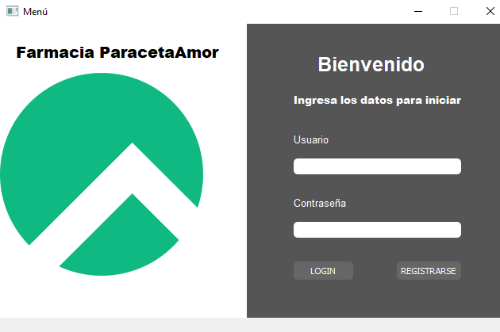
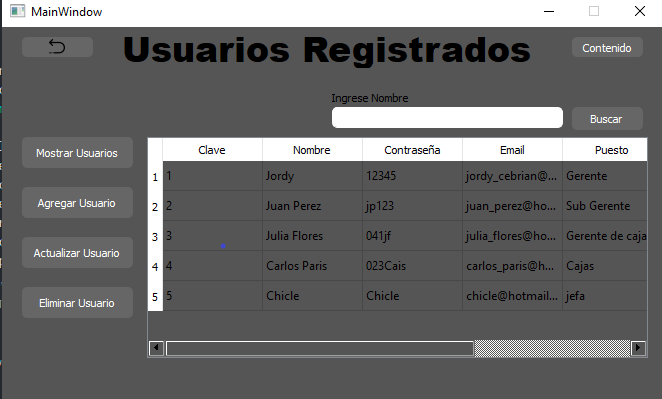
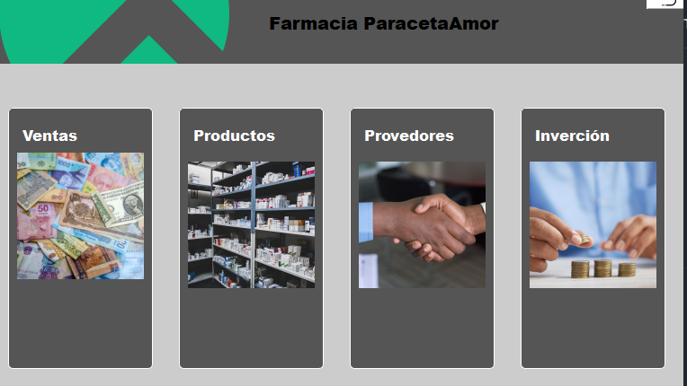
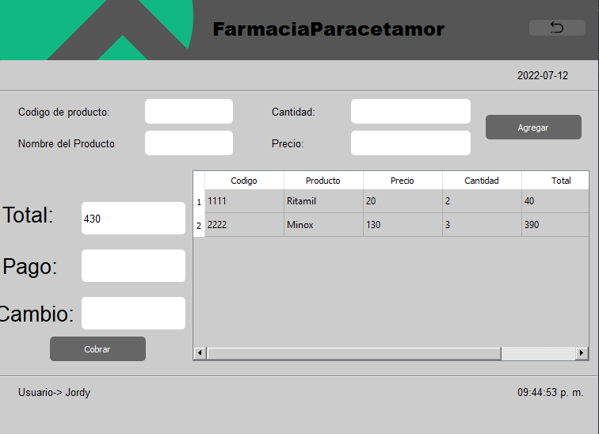
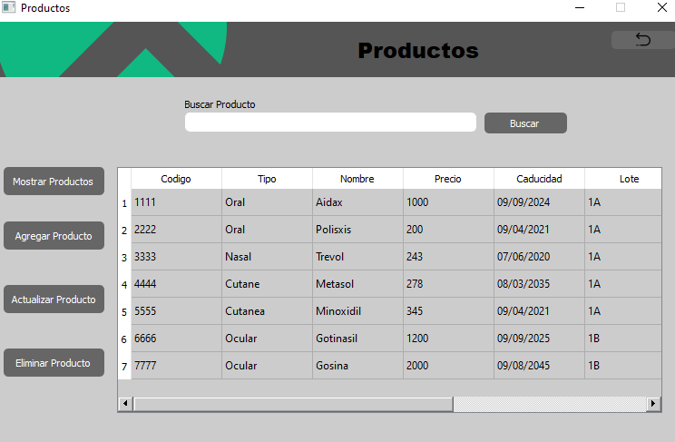
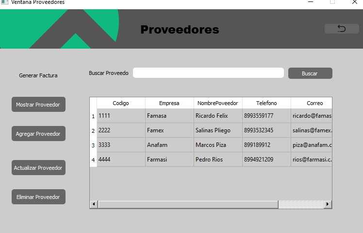
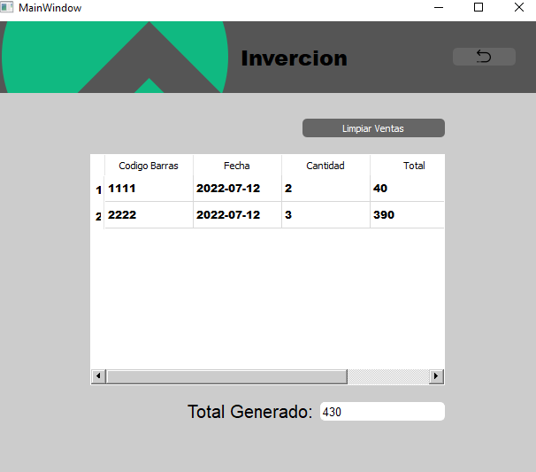

# Punto de Venta Paracetamor

## Herramietas Usaddas 
* python
* sqlserver
* Qtdisainer

## Objetivo
El objetivo de nuestra app de escritorio es la administracion de una farmacia, registro de sus productos y manejo, ventas de los productos, manejo de proveedores, facturacion a proveedores y control de inverción.

## Contenido
El archivo core.py es el que contiene el arranque del proyecto solo se puede correr desde ahí, los archivos .ui son los que se construyeron en el editor qtdisainer los cuales despues se convierten para pasarse a archivo .py y poder manejarlos por medio de clases que es lo que basicamente son los archivos de ui a py, de hecho los archivos que comienzan con ui_ son la converción de los ui, las cuales son las ventanas de la app, EL CODIGO PRINCIPAL SE ENCUENTRA EN EL ARCHIVO main.py AHÍ ES DONDE SE ENCUENTRA LA LOGICA DE TODO EL PROGRAMA, ademas de el archivo database.py que contiene la conexion e interaccion con la base de datos la cual se encuentra en mi compu, si quieres trabajar con todo el programa tienes que crear la tuya, a mi parecer realize el codigo muy legible usando nombres faciles para mis funciones, metodos y variables, la app comienza con un Inico de secion.
## Imagen ventana de inicio
#
## 

el cual solo pueden acceder usuarios registrados, la app cuenta con una ventana para agregar usuarios, para acceder a ella tienes que estar dado de alto en la base de datos con un usuario proporcionado por nosostros.
#
## Imagen ventana usuarios
## 
#
## Imagen ventana contenido
## 
en caso de estar registrado y la validacion sea correcta nos arrojara la ventana principal con cuatro tarjetas, con las opciones ventas, productos, proveedores y invercion.
#
## Ventana Ventas
En esta ventana es donde se realizara la venta de los productos y sus diferentes operaciones además de contar con la fecha, hora, nombre de usuario. la ventana cuenta con 4 cajas de texto que reciben parametros del producto al pulsar el boton de aceptar se mostraran en la tabla los productos y se mostrara el total de los prodcutos adquiridos, y en la caja pago se pondra el dinero que se reciba y en cambio se mostrara el sobrante una vez se pulso el boton cobrar.
## 
#
## Ventana Productos
En esta ventana se muestra los productos que estan disponibles en la farmacia al momento de la captura de pantalla, cuenta con 4 botones para mostrar,registrar, actualizar, borraar productos además de un buscador de individual de prodcutos por si la lista es muy larga, muestra el codigo el cual es importante para poder actualizar o borrar el producto ya que todos los botones menos el de mostrar muestran una ventana correspondiente al boton.
## 
#
## Ventana Proveedores
En la ventana proveedores como la ventana anterior y las demás cuenta con el mismo tipo de diseño los botones realizan las mismas operaciones igual la opcion de buscar solo que en este caso esta ventana se encarga de manejar proveedores además de contar con un boton que realiza facturas para los proveedores.
## 
#
## Ventana Inverción
En esta ventana que solo cuenta con una tabla y una caja donde se muestra el total de los productos que se han vendido durante todo el tiempo que se quiera ademas cuenta con un boton de limpiar toda la tabla para poder reiniciarse y así comensar de nuevo el registro.
## 
#
#
# Detalles del codigo
En el archivo donde esta la logica del programa(main.py), el archivo empieza por las clase importadas de los archivos ui convertidos a extencion python, en el codigo se encuentra comentado de donde a donde se encuentran estas librerias, despues uso librerias que uso para poder convertir imagenes y mostrarlas en pantalla las uso para dar una muestra del producto, despues algunas variables globales que uso para poder manejar esos variables en otras clases por todo el codigo, despues vienen las ventanas programadas de arriba hacia abajo siendo la primera la clase padre y las demas hijas de esta, la sentencia parent=None es necesaria para poder diferenciar a la clase padre de las hijas, el codigo cuenta con comentarios que indican cada parte de codigo de cada ventana.
si tienes alguna duda puedes contactarme a jordy_cebrian@hotmail.com.
#
## Uso de Proyecto y detalles de instalación.
Siente libre de usar este codigo como quieras, yo aprendí mucho gracias e este proyecto algunas cosas las busque y no las encontre en internet así que si te sirve algo sinetete libre de bajar el codigo y hacer lo que quieras con el.
## Aviso
las imagenes que ves aqui no se cargaran en tu computadora ya que yo las cometi el error de ponerlas desde Qtdisainer y no se guardaron, así que a la hora de convertir el archivo a .exe se mostrara sin imagenes, ejemplo logo, imagenes tarjetas botones, logo en cada ventana y flecha de boton regresar, pero creo que es una ventana pues si quieres usar tus propias imagenes sera más facil.
si quieres convertir el archivo a ejecutable hay que instalar una libreria llamada pyinstaller, para instalarla solo pon en la linea de comandos pip install pyinstaller y enter, una vez hecho esto escribes el comando pyinstaller --windowed --onefile NombredelArchivo y listo se genera la carpeta con el ejecutable.
Gracias por leer esto, espero y te sirva.
contacto jordy_cebrian@hotmail.com